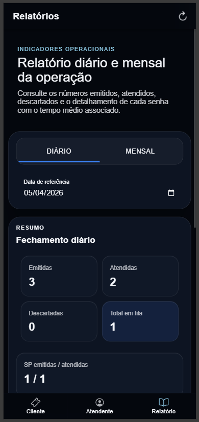

# MobileTicketsIonic

Sistema de controle de atendimento desenvolvido com Ionic, Angular e Capacitor no frontend, Node.js + Express no backend e MySQL 8 para persistencia. O projeto usa template `tabs` e organiza a interface em tres areas principais: cliente, atendente e relatorio.

## Visao geral

O aplicativo foi pensado para fluxo de senhas em ambientes de atendimento. O cliente emite senhas e acompanha a fila, o atendente chama a proxima senha com controle de guiche e o relatorio apresenta os indicadores diarios e mensais da operacao.

## Integrantes do grupo

1. Arnaldo Reis
2. Carla Rayanne
3. Emilly Mayra
4. Gustavo Lopes
5. Higor Ricardo

## Capturas de tela

As imagens abaixo documentam as tres telas principais do app:




## Tecnologias

- Ionic 7
- Angular 17
- Capacitor 5
- Node.js + Express
- MySQL 8
- Arquitetura limpa no backend

## Estrutura do projeto

- `frontend/`: aplicacao Ionic/Angular com as abas Cliente, Atendente e Relatorio
- `backend/`: API em Node.js com use cases, dominio, infraestrutura e controller HTTP
- `db/`: imagem de inicializacao do MySQL e script SQL
- `docker-compose.yml`: orquestracao dos containers de banco, backend e frontend
- `docs/screens/`: imagens usadas na documentacao do projeto

## Como executar

### Com Docker

```bash
docker compose up --build
```

O `docker compose` aceita um arquivo `.env` na raiz para sobrescrever variaveis como `BACKEND_PORT`, `FRONTEND_PORT`, `MYSQL_ROOT_PASSWORD`, `MYSQL_DATABASE`, `MYSQL_USER` e `MYSQL_PASSWORD`.

### Frontend local

```bash
cd frontend
npm install
npm run start
```

Em desenvolvimento local, o frontend consome a API em `http://localhost:3000/api`.

### Backend local

```bash
cd backend
npm install
npm run dev
```

O backend le `PORT`, `DB_HOST`, `DB_PORT`, `DB_USER`, `DB_PASSWORD` e `DB_NAME` do ambiente, com valores padrao prontos para desenvolvimento.

## Scripts disponiveis

### Frontend

- `npm run start`: sobe o Angular em modo desenvolvimento
- `npm run build`: gera a versao de producao
- `npm run test`: executa os testes
- `npm run lint`: executa o lint

### Backend

- `npm run dev`: executa a API em modo observavel
- `npm run build`: compila TypeScript para `dist`
- `npm run start`: inicia a aplicacao compilada
- `npm run lint`: executa o lint

## Endpoints principais

- `POST /api/tickets/issue` - emite senha
- `POST /api/tickets/next` - chama a proxima senha
- `GET /api/tickets/overview` - painel diario
- `GET /api/tickets/reports?period=daily|monthly` - relatorios
- `GET /health` - health check da API

## Regras implementadas

- Senhas `SP`, `SG` e `SE`
- Numeracao diaria no formato `YYMMDD-PPSQ`
- Descarte automatico de 5% das senhas
- Chamada em ciclo respeitando prioridade e alternancia
- Relatorio diario e mensal com resumo e detalhamento
- Tempo medio de atendimento por tipo de senha

## Licenca

Este repositorio usa a licenca CC0 1.0 Universal. Veja o arquivo [LICENSE](LICENSE) para os termos completos.